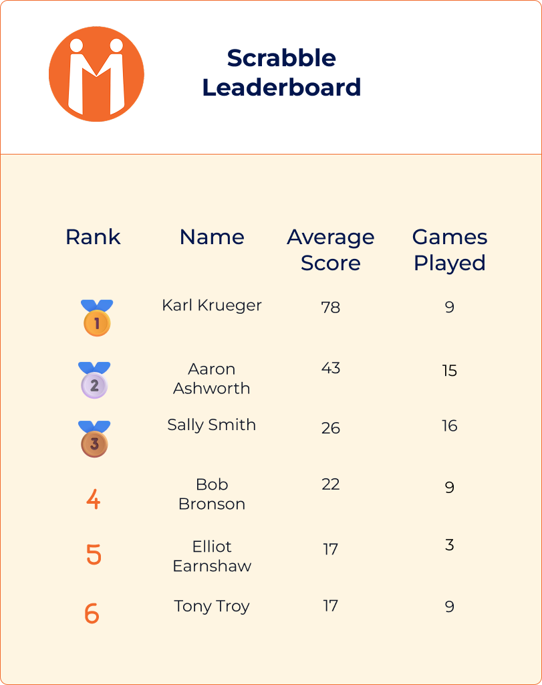
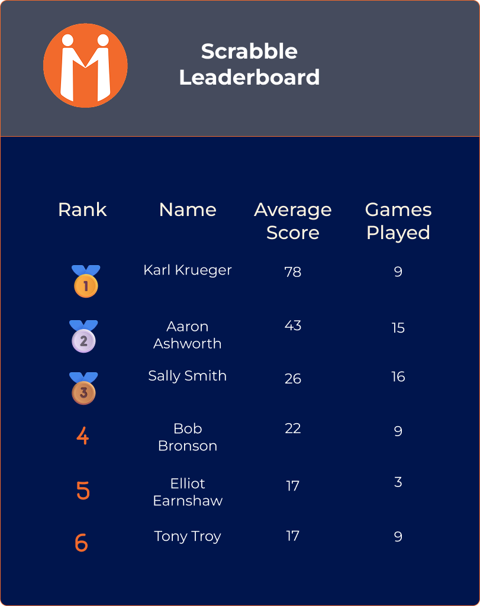
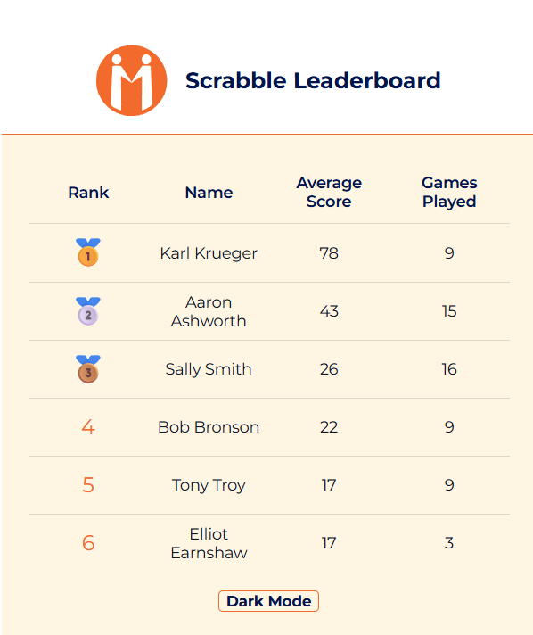
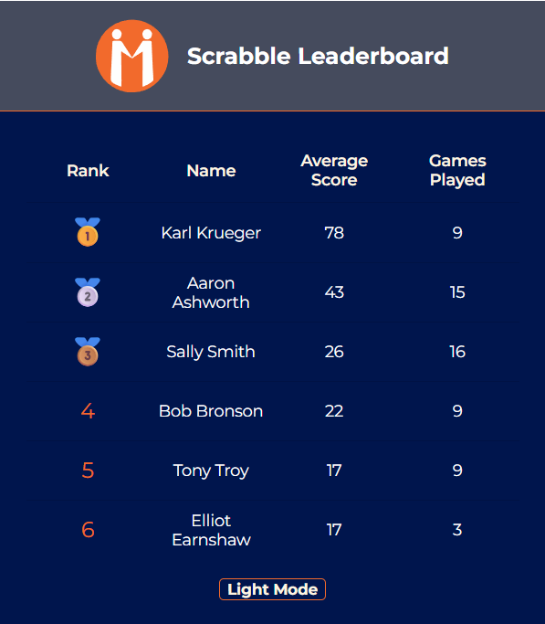
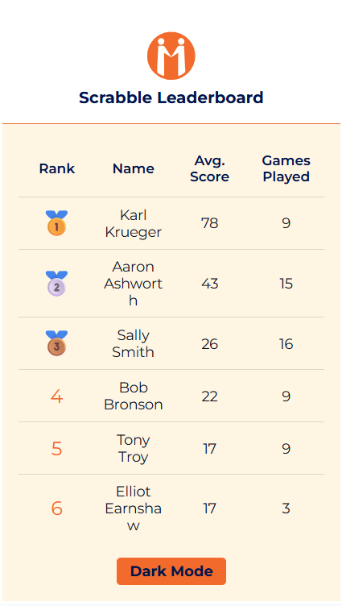
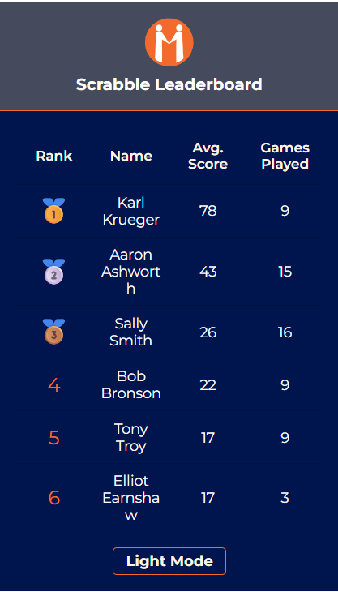

# 🧠 Scrabble Leaderboard – MAB Coding Task

A fully responsive, accessible leaderboard built with **Angular 17**, **Angular Material**, and **SCSS**. The component toggles between light and dark themes, adjusts column layout based on screen size (mobile vs desktop), and fetches mock data from a REST API using **HttpClient**.

---

Live Demo - https://katiec97.github.io/mab-leaderboard/ 

---

## 📸 Screenshots

| View                                          | Mode                         | Device  |
| --------------------------------------------- | ---------------------------- | ------- |
|    | Figma Wireframe – Light Mode | Desktop |
|     | Figma Wireframe – Dark Mode  | Desktop |
|  | Live Component – Light Mode  | Desktop |
|   | Live Component – Dark Mode   | Desktop |
|   | Live Component – Light Mode  | Mobile  |
|    | Live Component – Dark Mode   | Mobile  |

---

## 🛠️ Tech Stack

- **Angular 17**
- **Angular Material** (MatTable, Theming)
- **SCSS**
- **CDK BreakpointObserver**
- **RxJS**
- **Lighthouse**
- **Beeceptor (Mock API)**

---

## ⚙️ Features

- 📊 Displays leaderboard table with: rank, name, average score, games played
- 🥇 Emoji medals for top 3 players
- 🎨 Light/Dark mode toggle with accessible contrast
- 📱 Responsive layout using Angular CDK breakpoints
- 🧪 Fully unit tested with Jasmine/Karma
- ♿️ Lighthouse 100 score for Accessibility
- 🧠 ARIA labels and caption for screen reader support
- 📁 Clean folder structure with standalone component setup

---

## 🚀 Getting Started

```bash
npm install
ng serve
```

To run unit tests:

```bash
ng test
```

---

## 🔗 API

- Data fetched from: `https://mp4dc70630401865409.free.beeceptor.com/data`
- Matches `scrabblePlayerId` against `players.json` to render full leaderboard

---

## ♿ Accessibility

- ✅ ARIA - `aria-label` for context
- ✅ Visually hidden `<caption>` for screen reader context
- ✅ Keyboard-accessible toggle button with `aria-label`
- ✅ Responsive text, spacing, and touch targets
- ✅ Font uses `rem` units instead of `px`
- ✅ Contrast checked for dark/light theme combinations

---

## 🧪 Testing

- ✅ 100% of component functionality unit tested:
- Component renders
- Data fetch on init
- Correct layout on mobile/desktop
- Toggle theme button
- DOM rendering tests (header, values, fallback conditions)

---

## 💬 Notes

- Final Lighthouse scores:
- **Accessibility**: 100
- **Best Practices**: 100
- **SEO**: 100
- **Performance**: ~48–51 (due to development mode, render-blocking fonts, and local server)
- Fonts preloaded from Google Fonts (`Montserrat`, `Material Icons`)

---

## 👩‍💻 Created by

**Katie Cox** – [GitHub](https://github.com/KatieC97) · Final stage candidate for the Frontend Developer role at Mortgage Advice Bureau
